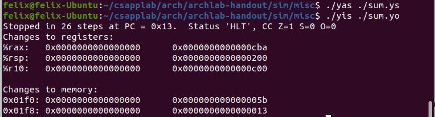
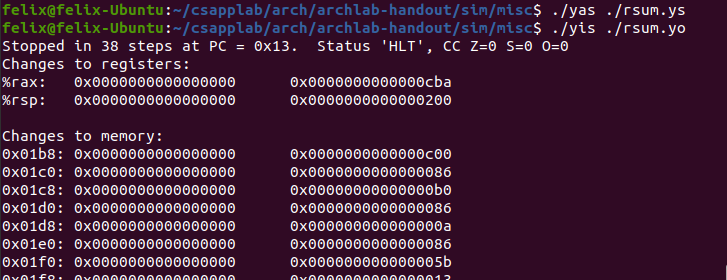
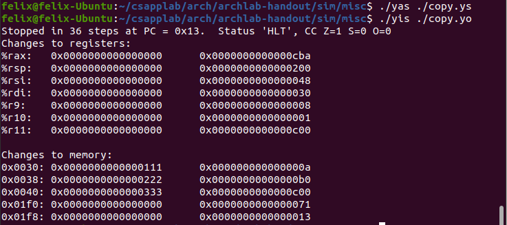

# archlab

这个实验真的让人头发掉下来，现在还是有点懵逼，按照*archlab.png* 的要求，先把实验环境配置好。（中间出了一点小问题，不过还是解决了）

```
cd sim
sudo apt-get install tcl-dev tk-dev
sudo apt install bison
sudo apt install flex
make clean; make
```

## Pase A

第一小题三部分，用Y86-64实现示例代码

#### sum_list

第一个函数sum_list，功能是求和val所有值

```
/* sum_list - Sum the elements of a linked list */
long sum_list(list_ptr ls)
{
	long val = 0;
	while (ls) {
		val += ls->val;
		ls = ls->next;
	}
	return val;
}
```

幸好在书上有一个类似的代码（*p252*），是用数组实现累加求和（和我们要做的链表总体上差不多），仔细研究了一下书上的代码。抓光了一头的头发，终于写出来了第一题。(虽然是模仿，万事开头难嘛)

```
		.pos 0
		irmovq stack, %rsp
		call main
		halt

		.align 8
ele1:
		.quad 0x00a
		.quad ele2
ele2:
		.quad 0x0b0
		.quad ele3
ele3:
		.quad 0xc00
		.quad 0

main:
		irmovq ele1, %rdi
		call sum_list
		ret
		
sum_list:
		xorq %rax, %rax
		jmp test
loop:
		mrmovq (%rdi), %r10
		addq %r10, %rax
		mrmovq 8(%rdi), %rdi
test:
		andq %rdi, %rdi
		jne loop
		ret

		.pos 0x200
stack:
```

测试：




#### rsum.ys

在第一题的基础上运用了递归。用到了‘and ~~~ je’判断是否为0进行跳转。运用栈和调用自己实现递归。

```
		.pos 0
		irmovq stack, %rsp
		call main
		halt

		.align 8
ele1:
		.quad 0x00a
		.quad ele2
ele2:
		.quad 0x0b0
		.quad ele3
ele3:
		.quad 0xc00
		.quad 0

main:
		irmovq ele1, %rdi
		call rsum_list
		ret
rsum_list:
		pushq %r9
		andq %rdi, %rdi
		je test
		mrmovq (%rdi), %r9
		mrmovq 8(%rdi), %rdi
		call rsum_list
		addq %r9, %rax
test:
		popq %r9
		ret

		.pos 0x200
stack:
```


测试：



#### copy.ys

把*src* 的值给*dest*，对*result*和*src*进行异或运算,最后得到的结果为*src*求和。

写的有点乱，寄存器乱用..还要再多看看

```
		.pos 0
		irmovq stack, %rsp
		call main
		halt

		.align 8
src:
		.quad 0x00a
		.quad 0x0b0
		.quad 0xc00

dest:
		.quad 0x111
		.quad 0x222
		.quad 0x333

main:
		irmovq src, %rdi
		irmovq dest, %rsi
		irmovq $3, %r8
		xorq %rax, %rax
		call copy
		ret
copy:
		irmovq $8, %r9
		irmovq $1, %r10
		andq %r8, %r8
		jmp		test
loop:
		mrmovq (%rdi), %r11
		rmmovq %r11, (%rsi)
		xorq %r11, %rax
		addq %r9, %rdi
		addq %r9, %rsi
		subq %r10, %r8
test:
		jne		loop
		ret
		
		.pos 0x200
stack:
```

测试：




## Pase B

对照书本图4-18一点点改，磕磕绊绊终于改出来了

```
# Determine instruction code
word icode = [
	imem_error: INOP;
	1: imem_icode;		# Default: get from instruction memory
];

# Determine instruction function
word ifun = [
	imem_error: FNONE;
	1: imem_ifun;		# Default: get from instruction memory
];

bool instr_valid = icode in 
	{ IIADDQ, INOP, IHALT, IRRMOVQ, IIRMOVQ, IRMMOVQ, IMRMOVQ,
	       IOPQ, IJXX, ICALL, IRET, IPUSHQ, IPOPQ };

# Does fetched instruction require a regid byte?
bool need_regids =
	icode in { IIADDQ, IRRMOVQ, IOPQ, IPUSHQ, IPOPQ, 
		     IIRMOVQ, IRMMOVQ, IMRMOVQ };

# Does fetched instruction require a constant word?
bool need_valC =
	icode in {  IIRMOVQ, IIADDQ, IRMMOVQ, IMRMOVQ, IJXX, ICALL };

################ Decode Stage    ###################################

## What register should be used as the A source?
word srcA = [
	icode in { IRRMOVQ, IRMMOVQ, IOPQ, IPUSHQ  } : rA;
	icode in { IPOPQ, IRET } : RRSP;
	1 : RNONE; # Don't need register
];

## What register should be used as the B source?
word srcB = [
	icode in { IOPQ, IRMMOVQ, IMRMOVQ,IIADDQ } : rB;
	icode in { IPUSHQ, IPOPQ, ICALL, IRET } : RRSP;
	1 : RNONE;  # Don't need register
];

## What register should be used as the E destination?
word dstE = [
	icode in { IRRMOVQ } && Cnd : rB;
	icode in { IIRMOVQ, IOPQ, IIADDQ } : rB;
	icode in { IPUSHQ, IPOPQ, ICALL, IRET } : RRSP;
	1 : RNONE;  # Don't write any register
];

## What register should be used as the M destination?
word dstM = [
	icode in { IMRMOVQ, IPOPQ } : rA;
	1 : RNONE;  # Don't write any register
];

################ Execute Stage   ###################################

## Select input A to ALU
word aluA = [
	icode in { IRRMOVQ, IOPQ } : valA;
	icode in { IIRMOVQ, IRMMOVQ, IMRMOVQ, IIADDQ } : valC;
	icode in { ICALL, IPUSHQ } : -8;
	icode in { IRET, IPOPQ } : 8;
	# Other instructions don't need ALU
];

## Select input B to ALU
word aluB = [
	icode in { IRMMOVQ, IMRMOVQ, IOPQ, ICALL, 
		      IPUSHQ, IRET, IPOPQ, IIADDQ } : valB;
	icode in { IRRMOVQ, IIRMOVQ } : 0;
	# Other instructions don't need ALU
];

## Set the ALU function
word alufun = [
	icode == IOPQ : ifun;
	1 : ALUADD;
];

## Should the condition codes be updated?
bool set_cc = icode in { IOPQ, IIADDQ };

```


Pase C没来得及做...我错了我错了..这周一定看书加补上


